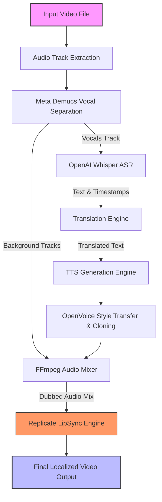

# Auto_Dub: Enterprise-Grade AI Video Dubbing & LipSync Pipeline

[](https://opensource.org/licenses/MIT)
[](#)
[](#contributing)

Auto_Dub is a sophisticated, production-ready video localization and translation pipeline. It automates the process of transcribing, translating, and dubbing video assets or live streams using advanced AI voice-cloning technology. By synchronizing mouth movements with translated audio, it delivers natural, studio-quality localized video content.

Developed by **[Lithesh P A](https://github.com/litheshpa80)**.

---

## 📖 Table of Contents
* [Key Capabilities](#-key-capabilities)
* [System Architecture](#-system-architecture)
* [Technology Stack](#-technology-stack)
* [Installation & Setup](#-installation--setup)
* [Usage Reference](#-usage-reference)
  * [FastAPI Web Interface](#1-fastapi-web-interface)
  * [Command Line Interface (CLI)](#2-command-line-interface-cli)
* [Project Directory Structure](#-project-directory-structure)
* [System Resource Guidelines](#-system-resource-guidelines)
* [Troubleshooting & Support](#-troubleshooting--support)
* [Contributing](#contributing)
* [License](#-license)

---

## ✨ Key Capabilities

* 🔊 **Zero-Shot Voice Cloning**: Preserves the original speaker's vocal timber, tone, and inflection in the target language using **OpenVoice (MyShell AI)**.
* 🎵 **Vocal & Background Separation**: Integrates Meta's **Demucs** model to isolate and preserve background scores, sound effects (SFX), and ambient noise, ensuring theatrical fidelity.
* 🗣️ **Robust Speech Recognition**: Powered by OpenAI's **Whisper** to accurately transcribe source audio and extract precise word-level timestamps.
* 👄 **Sub-Second LipSync**: Utilizes cloud-hosted **Replicate HeadGen** (`heygen/lipsync-speed`) to naturally align mouth movements with the newly synthesized audio.
* 🌍 **Global Localization**: Scalable design supporting translation and dubbing across 40+ languages.
* ⚡ **FastAPI Backend & Interactive UI**: Provides a clean, modern dashboard for job queuing, processing tracking, and asset previewing.

---

## 🏗️ System Architecture

Auto_Dub adopts a **hybrid processing model** that runs low-latency tasks locally while offloading compute-intensive deep learning tasks (such as LipSync synthesis) to scalable cloud API workers.



---

## 🛠️ Technology Stack

| Component | Engine / Tool | License | Purpose |
| :--- | :--- | :--- | :--- |
| **Speech Recognition (ASR)** | OpenAI Whisper | MIT | Transcribes speech and extracts timestamp logs |
| **Voice Cloning (TTS)** | OpenVoice (MyShell AI) | MIT | Synthesizes target vocals inheriting source voice tone |
| **Acoustic Separation** | Meta Demucs | CC0 | Dissects speech from background scoring & ambient noise |
| **Audio/Video Assembly** | FFmpeg | GPL 2.0 | Handles demuxing, sample rate conversions, and muxing |
| **Lip Synchronization** | Replicate (HeyGen) | Commercial | Synchronizes visual mouth movements to match dubbed audio |
| **Backend Framework** | FastAPI + Uvicorn | MIT | Orchestrates processing queues and API endpoints |
| **Control Dashboard** | Gradio / Vanilla HTML5 | Apache-2.0 | Visual interface for job submissions and monitoring |

---

## 📦 Installation & Setup

### Prerequisites
* Python `3.8` through `3.11`
* [FFmpeg](https://ffmpeg.org/) installed and added to system environmental `PATH` variables.
* Recommended: GPU instance with CUDA capabilities for accelerated local transcription/separation.

### 1. Repository Setup
```bash
git clone https://github.com/litheshpa80/Auto_Dub.git
cd Auto_Dub
```

### 2. Environment Virtualization
```bash
# Create the virtual environment
python -m venv .venv

# Activate on Windows
.venv\Scripts\activate

# Activate on macOS/Linux
source .venv/bin/activate
```

### 3. Dependency Installation
```bash
# Upgrade package installers
pip install --upgrade pip setuptools wheel

# Install core packages
pip install -r requirements.txt
pip install replicate gradio_client elevenlabs openvoice
```

### 4. Configuration
Create a `.env` file in the root directory to store your API credentials securely:

```env
# Replicate Credentials (Required for LipSync)
REPLICATE_API_TOKEN=your_replicate_api_key_here

# ElevenLabs Credentials (Optional, for high-fidelity TTS)
ELEVENLABS_API_KEY=your_elevenlabs_api_key_here

# OpenAI Credentials (Optional, if offloading ASR to OpenAI API)
OPENAI_API_KEY=your_openai_api_key_here
```

> [!WARNING]  
> Never commit your `.env` file to version control repositories. It is automatically ignored in this repository's `.gitignore` configuration.

---

## 🖥️ Usage Reference

### 1. FastAPI Web Interface
Launch the FastAPI development server:
```bash
python stitch/backend.py
```
Once initialized, navigate to:
* **Interactive Control Dashboard:** `http://127.0.0.1:8001/ui`
* **API Documentation (Swagger UI):** `http://127.0.0.1:8001/docs`

### 2. Command Line Interface (CLI)
You can directly invoke the pipeline wrapper script `dubber.py`:

```bash
# Basic Dubbing (Translating video to Spanish, outputting audio/video mix)
python dubber.py --input raw_footage.mp4 --output output_es.mp4 --language es

# Advanced Dubbing (Voice Cloning + Cloud LipSync enabled)
python dubber.py --input raw_footage.mp4 --output output_es.mp4 --language es --lipsync --voice_strength 0.85
```

#### CLI Parameters Glossary
* `--input` *(string, required)*: Path to the target source video file.
* `--output` *(string, required)*: Destination path for the generated dubbed video.
* `--language` *(string, required)*: Two-letter ISO target language code (e.g., `es`, `fr`, `de`, `ja`, `zh`).
* `--lipsync` *(boolean flag)*: Triggers the Replicate cloud LipSync synchronization process.
* `--voice_strength` *(float, default: `0.7`)*: Value between `0.0` and `1.0` controls the intensity of voice cloning style transfer.
* `--tts_engine` *(string, default: `local`)*: Choice between `local` (OpenVoice/Local TTS) and `elevenlabs` (ElevenLabs premium TTS API).

---

## 📁 Project Directory Structure

```
Auto_Dub/
├── .github/                   # CI/CD and repository settings
├── .gitignore                 # Version control file filters
├── README.md                  # Comprehensive project manual
├── dubber.py                  # Main execution entrypoint for CLI pipeline
├── requirements.txt           # Python application dependencies
├── stitch/                    # Web Interface & API System
│   ├── backend.py            # FastAPI Routing & Job Processing Engine
│   ├── dub_logic.js          # JavaScript Client interface logic
│   ├── final_ui.html         # Frontend Interface HTML
│   └── DESIGN.md             # Architectural and layout documentation
├── OpenVoice/                # Voice Cloning Module
│   ├── openvoice/            # Core inference code
│   └── checkpoints_v2/       # Model weights (Local only, Git ignored)
└── whisper-main/             # Local OpenAI Whisper Module
```

---

## ⚡ System Resource Guidelines

| Metric | Minimum Specifications | Recommended Specifications |
| :--- | :--- | :--- |
| **CPU Cores** | 4 Cores | 8+ Cores |
| **System RAM** | 8 GB | 16 GB+ |
| **VRAM (GPU)** | N/A (CPU execution) | 8 GB+ (CUDA-compatible) |
| **Disk Space** | 20 GB (Models + OS) | 100 GB+ (High-speed NVMe) |

---

## 🔍 Troubleshooting & Support

### Issue: "REPLICATE_API_TOKEN is missing or unauthorized"
> [!IMPORTANT]  
> Verify your API token at [Replicate API Settings](https://replicate.com/account/api-tokens). Make sure your key has positive balance/quota.

### Issue: "CUDA Out of Memory"
* Reduce local video input segments to smaller chunks (e.g., 1–3 minutes) using FFmpeg before processing.
* Toggle `--tts_engine elevenlabs` to offload local TTS synthesis overhead.
* Force CPU execution by setting PyTorch environment variables if VRAM is severely limited.

---

## 🤝 Contributing

Contributions are welcome! Please feel free to open a Pull Request or report issues. 

1. Fork the project.
2. Create your Feature Branch (`git checkout -b feature/AmazingFeature`).
3. Commit your changes (`git commit -m 'Add some AmazingFeature'`).
4. Push to the Branch (`git push origin feature/AmazingFeature`).
5. Open a Pull Request.

---

## 📄 License

This software is distributed under the [MIT License](LICENSE). Please review individual component licensing files for details regarding Meta Demucs and MyShell AI models.
